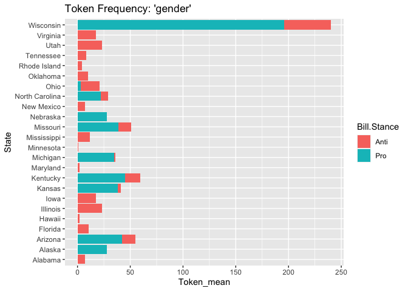

LGBTQ Laws Text Analysis
================
Mack Campbell

# Creating State Dataframe

``` r
# Equaldex and MAP have data on more than the 50 states, so this will be used to filter and cross-reference state name and abbreviations.
States <- tibble(State = state.name, State.Abbr = state.abb)
```

# Web Scraping / Data Collection

## Table Scraping and Manipulation

### Equaldex

[Equaldex](https://www.equaldex.com/equality-index/united-states)
measures legal protections and public opinions of those in the LGBTQ+
community to come up with an overall equality index per state.

``` r
Equaldex_url <- read_html("https://www.equaldex.com/equality-index/united-states")

# extracting the raw data
Equaldex_raw <- Equaldex_url %>% 
  html_element(xpath ='//*[@id="content"]/div[3]/table') %>% 
  html_table()
```

``` r
# extracting and manipulating the data
# index is on a scale out of 100
Equaldex_df <- Equaldex_url %>% 
  html_element(xpath ='//*[@id="content"]/div[3]/table') %>% 
  html_table() %>% 
  # separating column data
  separate('State and Territory', into = c('Rank', 'State'), sep = "\\. ", convert = T) %>% 
  separate('Equality Index', into = c('Equality_Index', 'Max1'), convert = T) %>% 
  separate('Legal Index', into = c('Legal_Index', 'Max2'), convert = T) %>% 
  separate('Public Opinion Index', into = c('Public_Opinion_Index', 'Max3'), convert = T) %>% 
  #removing unnecessary columns 
  select(-c(Max1, Max2, Max3)) %>%  
  semi_join(States, by = 'State')
```

    Warning: Expected 2 pieces. Missing pieces filled with `NA` in 51 rows [2, 3, 4, 5, 6, 7, 8, 9, 10, 11, 12, 13, 14, 15, 16, 17, 18, 19, 20, 21, ...].
    Expected 2 pieces. Missing pieces filled with `NA` in 51 rows [2, 3, 4, 5, 6, 7, 8, 9, 10, 11, 12, 13, 14, 15, 16, 17, 18, 19, 20, 21, ...].
    Expected 2 pieces. Missing pieces filled with `NA` in 51 rows [2, 3, 4, 5, 6, 7, 8, 9, 10, 11, 12, 13, 14, 15, 16, 17, 18, 19, 20, 21, ...].

``` r
head(Equaldex_df)
```

    # A tibble: 6 × 5
       Rank State         Equality_Index Legal_Index Public_Opinion_Index
      <int> <chr>                  <int>       <int>                <int>
    1     1 Vermont                   86          98                   74
    2     2 Massachusetts             86          98                   74
    3     3 Connecticut               85          98                   71
    4     4 New Hampshire             85          98                   71
    5     5 Rhode Island              84          98                   70
    6     7 New York                  82          98                   67

### MAP

[Movement Advancement Project
(MAP)](https://www.lgbtmap.org/equality-maps) measures seven different
aspects of state protections for gender identity (GI) and sexual
orientation (SO).

``` r
MAP_url <- read_html("https://www.lgbtmap.org/equality-maps")

# extracting the raw data
MAP_raw <- MAP_url %>% 
  html_element(xpath = '//*[@id="map-4"]/div/table') %>% 
  html_table()
```

``` r
# extracting and manipulating
MAP_df <- MAP_url %>% 
  html_element(xpath = '//*[@id="map-4"]/div/table') %>% 
  html_table(header = T) %>% # works to rename, how to make it proper titles, how to add missing titles?
  rename('Alpha_Rank' = 1, 'Measured_Category' = 3) %>%  #renaming empty columns
  select(-Alpha_Rank) %>% #removes unnecessary initial column that numbered state positions
  semi_join(States, by = 'State') %>% 
  #separating the score and the scale
  separate('Relationship andParental Recognition', into = c('Relationship_and_Parental_Recognition', 'Relationship_and_Parental_Recognition_Scale'), sep = '/', convert = T) %>% 
  separate('Non–Discrimination', into = c('Non-Discrimination', 'Non-Discrimination_Scale'), sep = '/', convert = T) %>% 
  separate('Religious Exemption Laws', into = c('Religious_Exemption_Laws', 'Religious_Exemption_Laws_Scale'), sep = '/', convert = T) %>% 
  separate('LGBT Youth', into = c('LGBT_Youth', 'LGBT_Youth_Scale'), sep = '/', convert = T) %>% 
  separate('Healthcare', into = c('Healthcare', 'Healthcare_Scale'), sep = '/', convert = T) %>% 
  separate('CriminalJustice', into = c('Criminal_Justice', 'Criminal_Justice_Scale'), sep = '/', convert = T) %>% 
  separate('IdentityDocuments', into = c('Identity_Documents', 'Identity_Documents_Scale'), sep = '/', convert = T) %>% 
  rename('Sexual_Orientation_Policy_Tally' = 'Sexual Orientation Policy Tally', 'Gender_Identity_Policy_Tally' = 'Gender Identity Policy Tally', 'Overall_Tally'= 'Overall Tally')
```

    Warning: Expected 2 pieces. Missing pieces filled with `NA` in 50 rows [1, 3, 5,
    7, 9, 11, 13, 15, 17, 19, 21, 23, 25, 27, 29, 31, 33, 35, 37, 39, ...].

``` r
# Pivoting wider to separate gender identity and sexual orientation and cleaning up columns.
# vector types are a mess in the columns
MAP_df <- MAP_df %>% 
  pivot_wider(names_from = Measured_Category, names_sep = "_", values_from = Relationship_and_Parental_Recognition:Identity_Documents_Scale) %>% 
  select(-c(Identity_Documents_SO, Identity_Documents_Scale_SO)) %>%  # removing unnecessary columns
  # rearrange columns
  relocate('State', 'Relationship_and_Parental_Recognition_GI', 'Relationship_and_Parental_Recognition_Scale_GI','Relationship_and_Parental_Recognition_SO', 'Relationship_and_Parental_Recognition_Scale_SO', 'Non-Discrimination_GI', 'Non-Discrimination_Scale_GI', 'Non-Discrimination_SO', 'Non-Discrimination_Scale_SO', 'Religious_Exemption_Laws_GI', 'Religious_Exemption_Laws_Scale_GI','Religious_Exemption_Laws_SO', 'Religious_Exemption_Laws_Scale_SO', 'LGBT_Youth_GI', 'LGBT_Youth_Scale_GI', 'LGBT_Youth_SO', 'LGBT_Youth_Scale_SO', 'Healthcare_GI', 'Healthcare_Scale_GI', 'Healthcare_SO', 'Healthcare_Scale_SO', 'Criminal_Justice_GI', 'Criminal_Justice_Scale_GI', 'Criminal_Justice_SO', 'Criminal_Justice_Scale_SO', 'Identity_Documents_GI', 'Identity_Documents_Scale_GI', ends_with('Tally'))
head(MAP_df)
```

    # A tibble: 6 × 30
      State  Relat…¹ Relat…² Relat…³ Relat…⁴ Non-D…⁵ Non-D…⁶ Non-D…⁷ Non-D…⁸ Relig…⁹
      <chr>    <dbl>   <int>   <dbl>   <int>   <dbl>   <dbl>   <dbl>   <dbl>   <dbl>
    1 Alaba…       0       1    1          6    0        4.5    0        4.5    -2.5
    2 Alaska       1       1    3          6    3.5      4.5    3.5      4.5     0  
    3 Arizo…       0       1    2.5        6    1.75     4.5    1.75     4.5    -1.5
    4 Arkan…       0       1    2          6   -1        4.5   -1        4.5    -1.5
    5 Calif…       1       1    5.75       6    4.5      4.5    4.5      4.5     0  
    6 Color…       1       1    6          6    4.5      4.5    4.5      4.5     0  
    # … with 20 more variables: Religious_Exemption_Laws_Scale_GI <dbl>,
    #   Religious_Exemption_Laws_SO <dbl>, Religious_Exemption_Laws_Scale_SO <dbl>,
    #   LGBT_Youth_GI <dbl>, LGBT_Youth_Scale_GI <int>, LGBT_Youth_SO <dbl>,
    #   LGBT_Youth_Scale_SO <int>, Healthcare_GI <dbl>, Healthcare_Scale_GI <dbl>,
    #   Healthcare_SO <dbl>, Healthcare_Scale_SO <dbl>, Criminal_Justice_GI <dbl>,
    #   Criminal_Justice_Scale_GI <int>, Criminal_Justice_SO <dbl>,
    #   Criminal_Justice_Scale_SO <int>, Identity_Documents_GI <chr>, …

## Freedom for All Americans

The Freedom for All Americans’ website uses a widget for the law data I
am looking for, so I ran a JavaScript code that pulled all necessary
information and saved it as separate CSV files.

/\* Download State Tables from
<https://freedomforallamericans.org/legislative-tracker/>

    To use:
    1. Load https://freedomforallamericans.org/legislative-tracker/
    2. Copy & paste the entire script text into your browser's console
    3. Click a state on the map. In the console, hit <enter>/<return> to run this code
    4. Click another state, use the up arrow to load this script text again, rinse, and repeat

​90% of this code comes from
<https://www.geeksforgeeks.org/how-to-export-html-table-to-csv-using-javascript/>
Adapted by Dan Villarreal

    ​
    function tableToCSV(node) {
        // State name
        var sName = node.querySelector(".grid-head").innerText;
        var end = sName.search(/ \(/g);
        var sName = sName.slice(0, end);
        
        // Variable to store the final csv data
        var csv_data = [];
    ​
        // Get each row data
        var rows = node.querySelectorAll('.tableWrapper > table tr');
        for (var i = 0; i < rows.length; i++) {
    ​
            // Get each column data
            var cols = rows[i].querySelectorAll('td,th');
    ​
            // Stores each csv row data
            var csvrow = [];
            for (var j = 0; j < cols.length; j++) {
                // Get data from each cell & push it to csvrow
                // First cell in first row: "Link"
                if (i == 0 && j == 0) {
                    csvrow.push('Link')
                // First column: get link
                } else if (j == 0) {
                    csvrow.push(cols[j].querySelector('a').href);               
                // Otherwise: get text
                } else {
                    csvrow.push('"' + cols[j].innerText + '"');             
                } 
            }
    ​
            // Combine each column value with comma
            csv_data.push(csvrow.join(","));
        }
    ​
        // Combine each row data with new line character
        csv_data = csv_data.join('\n');
    ​
        // Call this function to download csv file
        downloadCSVFile(csv_data, sName);
    }
    ​
    function downloadCSVFile(csv_data, csv_name) {
    ​
        // Create CSV file object and feed
        // our csv_data into it
        CSVFile = new Blob([csv_data], {
            type: "text/csv"
        });
    ​
        // Create to temporary link to initiate
        // download process
        var temp_link = document.createElement('a');
    ​
        // Download csv file
        temp_link.download = csv_name;
        var url = window.URL.createObjectURL(CSVFile);
        temp_link.href = url;
    ​
        // This link should not be displayed
        temp_link.style.display = "none";
        document.body.appendChild(temp_link);
    ​
        // Automatically click the link to
        // trigger download
        temp_link.click();
        document.body.removeChild(temp_link);
    }
    ​
    var node = document.querySelector("#BT50MapWidget");
    tableToCSV(node);

Read in all files as a character vector.

``` r
# pro
pro_files <- list.files(path = 'data/State-Bill-csvs/Pro/', pattern = '.csv', full.names = T)

# anti
anti_files <- list.files(path = 'data/State-Bill-csvs/Anti/', pattern = '.csv', full.names = T)
```

And map over them to convert them into tibbles.

``` r
pro_laws <- pro_files %>% 
  map_dfr(., read_csv, name_repair = 'universal') %>% 
  # drop position, it is a blank column
  select(-c(Position)) %>% 
  rename('BillTrack.Link' = 'Link', 'State.Abbr' = 'State') %>%  
  mutate('Action.Year' = str_extract(Action.Date, '\\d\\d\\d\\d$'), .after = 'Action.Date') %>% 
  mutate('Bill.Stance' = 'Pro', .after = BillTrack.Link)
head(pro_laws)
```

    # A tibble: 6 × 13
      BillTr…¹ Bill.…² State…³ Bill.…⁴ Name  Last.…⁵ Actio…⁶ Actio…⁷ Spons…⁸ Spons…⁹
      <chr>    <chr>   <chr>   <chr>   <chr> <chr>   <chr>   <chr>     <dbl> <chr>  
    1 https:/… Pro     AK      HB17    Disc… REFERR… 4/4/20… 2022         11 Andrew…
    2 https:/… Pro     AZ      HB2744  Anti… Assign… 5/24/2… 2021          8 Daniel…
    3 https:/… Pro     FL      H0373   Deni… Died i… 3/14/2… 2022          3 Yvonne…
    4 https:/… Pro     GA      HB1332  Soci… House … 2/15/2… 2022          5 James …
    5 https:/… Pro     GA      HB1333  Gay … House … 2/15/2… 2022          5 James …
    6 https:/… Pro     IN      SB0128  Proh… First … 1/4/20… 2022          1 Timoth…
    # … with 3 more variables: Actions <dbl>, Versions <dbl>, Tracked <dbl>, and
    #   abbreviated variable names ¹​BillTrack.Link, ²​Bill.Stance, ³​State.Abbr,
    #   ⁴​Bill.Number, ⁵​Last.Action, ⁶​Action.Date, ⁷​Action.Year, ⁸​Sponsors,
    #   ⁹​Sponsor.List

``` r
anti_laws <- anti_files %>% 
  map_dfr(., read_csv, name_repair = 'universal') %>% 
  # drop position, it is a blank column
  select(-c(Position)) %>% 
  rename('BillTrack.Link' = 'Link', 'State.Abbr' = 'State') %>%  
  mutate('Action.Year' = str_extract(Action.Date, '\\d\\d\\d\\d$'), .after = 'Action.Date')%>% 
  mutate('Bill.Stance' = 'Anti', .after = BillTrack.Link)
head(anti_laws)
```

    # A tibble: 6 × 13
      BillTr…¹ Bill.…² State…³ Bill.…⁴ Name  Last.…⁵ Actio…⁶ Actio…⁷ Spons…⁸ Spons…⁹
      <chr>    <chr>   <chr>   <chr>   <chr> <chr>   <chr>   <chr>     <dbl> <chr>  
    1 https:/… Anti    AL      HB11    Publ… Read f… 1/11/2… 2022          1 Danny …
    2 https:/… Anti    AL      HB150   Publ… Read f… 1/18/2… 2022          1 Wesley…
    3 https:/… Anti    AL      HB266   Publ… Pendin… 3/2/20… 2022         24 Wesley…
    4 https:/… Anti    AL      HB322   Publ… Delive… 4/7/20… 2022         45 Scott …
    5 https:/… Anti    AL      SB5     Publ… Read f… 1/11/2… 2022          1 Shay S…
    6 https:/… Anti    AL      SB184   Publ… Assign… 4/7/20… 2022          2 Shay S…
    # … with 3 more variables: Actions <dbl>, Versions <dbl>, Tracked <dbl>, and
    #   abbreviated variable names ¹​BillTrack.Link, ²​Bill.Stance, ³​State.Abbr,
    #   ⁴​Bill.Number, ⁵​Last.Action, ⁶​Action.Date, ⁷​Action.Year, ⁸​Sponsors,
    #   ⁹​Sponsor.List

Join them together and add full state name.

``` r
all_laws <- full_join(anti_laws, pro_laws) %>% 
  left_join(States, by = 'State.Abbr') %>% 
  relocate(State, .after = State.Abbr)
```

    Joining, by = c("BillTrack.Link", "Bill.Stance", "State.Abbr", "Bill.Number",
    "Name", "Last.Action", "Action.Date", "Action.Year", "Sponsors",
    "Sponsor.List", "Actions", "Versions", "Tracked")

``` r
head(all_laws)
```

    # A tibble: 6 × 14
      BillTrac…¹ Bill.…² State…³ State Bill.…⁴ Name  Last.…⁵ Actio…⁶ Actio…⁷ Spons…⁸
      <chr>      <chr>   <chr>   <chr> <chr>   <chr> <chr>   <chr>   <chr>     <dbl>
    1 https://w… Anti    AL      Alab… HB11    Publ… Read f… 1/11/2… 2022          1
    2 https://w… Anti    AL      Alab… HB150   Publ… Read f… 1/18/2… 2022          1
    3 https://w… Anti    AL      Alab… HB266   Publ… Pendin… 3/2/20… 2022         24
    4 https://w… Anti    AL      Alab… HB322   Publ… Delive… 4/7/20… 2022         45
    5 https://w… Anti    AL      Alab… SB5     Publ… Read f… 1/11/2… 2022          1
    6 https://w… Anti    AL      Alab… SB184   Publ… Assign… 4/7/20… 2022          2
    # … with 4 more variables: Sponsor.List <chr>, Actions <dbl>, Versions <dbl>,
    #   Tracked <dbl>, and abbreviated variable names ¹​BillTrack.Link,
    #   ²​Bill.Stance, ³​State.Abbr, ⁴​Bill.Number, ⁵​Last.Action, ⁶​Action.Date,
    #   ⁷​Action.Year, ⁸​Sponsors

## BillTrack50

The code below is how I used `rvest` to pull necessary information from
[BillTrack50](https://www.billtrack50.com/). I got explicit permission
to scrape this data, but their TOS prohibits scraping unless otherwise
approved.

``` r
# create a character vector of all urls to pull data from
billtrack_urls <- c(anti_laws$BillTrack.Link, pro_laws$BillTrack.Link)
```

It is too big to run as one, so I will chunk it up.

``` r
billtrack_df1 <- tibble('BillTrack.Link' = billtrack_urls[1:95]) %>% 
  mutate('Bill.PDF' = BillTrack.Link %>% map(~ .x %>% 
                                          read_html() %>% 
                                          # the links to each state information is housed in a table
                                          html_element('#docs-table') %>% 
                                          # returns a character vector/list in each column
                                          html_table() %>% 
                                            filter(grepl('Bill(Text)?', `Document Type`), 
                                                   grepl('pdf', `Source Location`, ignore.case = T)) %>% 
                                          pull(`Source Location`))) 

billtrack_df2 <- tibble('BillTrack.Link' = billtrack_urls[96:190]) %>% 
  mutate('Bill.PDF' = BillTrack.Link %>% map(~ .x %>% 
                                          read_html() %>% 
                                          html_element('#docs-table') %>% 
                                          html_table() %>% 
                                            filter(grepl('Bill(Text)?', `Document Type`), 
                                                   grepl('pdf', `Source Location`, ignore.case = T)) %>% 
                                          pull(`Source Location`)))

billtrack_df3 <- tibble('BillTrack.Link' = billtrack_urls[191:285]) %>% 
  mutate('Bill.PDF' = BillTrack.Link %>% map(~ .x %>% 
                                          read_html() %>% 
                                          html_element('#docs-table') %>% 
                                          html_table() %>% 
                                            filter(grepl('Bill(Text)?', `Document Type`), 
                                                   grepl('pdf', `Source Location`, ignore.case = T)) %>% 
                                          pull(`Source Location`)))
```

Join them into 1 df.

``` r
# creating one tibble
billtrack_df <- tibble('BillTrack.Link' = c(billtrack_df1$BillTrack.Link, billtrack_df2$BillTrack.Link, billtrack_df3$BillTrack.Link), 'State.Link' = c(billtrack_df1$Bill.PDF, billtrack_df2$Bill.PDF, billtrack_df3$Bill.PDF))
```

Unnest individual URLs, then filter for only PDFs.

``` r
billtrack_df <- billtrack_df %>% 
  # generates a row per URL
  unnest(cols = State.Link, keep_empty = T) %>% 
  # some state URLs are listed twice, remove duplicates
  filter(!duplicated(State.Link))
billtrack_df
```

Save the tibble as a csv to prevent future scraping.

``` r
# saving the tibble into a csv to avoid future scraping
billtrack_df %>% 
  write.csv('data/billtrackdf.csv', row.names = T)
```

Read in the csv instead of the tibble created above.

``` r
# read in billtrack_df without scraping
if (!exists("billtrack_df")) {
  billtrack_df <- read_csv('data/billtrackdf.csv')
}
```

    New names:
    Rows: 435 Columns: 3
    ── Column specification
    ──────────────────────────────────────────────────────── Delimiter: "," chr
    (2): BillTrack.Link, State.Link dbl (1): ...1
    ℹ Use `spec()` to retrieve the full column specification for this data. ℹ
    Specify the column types or set `show_col_types = FALSE` to quiet this message.
    • `` -> `...1`

I tested one link from each state to verify that the links worked.

``` r
# combine links and state info
state_pdf_df <- billtrack_df %>% 
  left_join(all_laws, by = 'BillTrack.Link') %>% 
  select(BillTrack.Link, Bill.Stance, State.Link, State) %>% 
  # Delaware returned an NA
  filter(!is.na(State.Link)) %>% 
  # indiana links generate a 503 error that could not be resolved
  # south dakota pdfs could not be read by pdf_text or pdf_ocr_text
  # washington links generated a url error
  filter(!State %in% c('Indiana', 'South Dakota', 'Washington')) %>% 
  # some non-pdfs slipped through
  filter(grepl('pdf$', State.Link, ignore.case = T)) %>% 
  # links for Virginia are formatted incorrectly (contains the string "+hil")
  mutate(State.Link = State.Link %>% map_chr( ~.x %>% 
    str_remove('\\+hil')))
```

# Working with PDFs

Instructions pulled from:
<https://data.library.virginia.edu/reading-pdf-files-into-r-for-text-mining/>

``` r
# create a function to extract and tidy up the pdfs
clean_pdf <- function(file) {
  file %>% 
    pdf_text() %>% 
    str_split("[\\r\\n]+") %>%
    # remove pagination
    flatten_chr() %>%  
    # trim leading white space
    str_trim() %>% 
    # remove inner white space
    str_squish() %>% 
    # remove line numbers
    str_remove("^\\d+")
  }  
```

The process was error-laden, so I broke the links up into small chunks
to be able to diagnose issues easier.

``` r
# running df through the extracting and cleaning function
state_text_df1 <- tibble('BillTrack.Link' = state_pdf_df$BillTrack.Link[1:50], 'Bill.Stance' = state_pdf_df$Bill.Stance[1:50], 'State.Link' = state_pdf_df$State.Link[1:50], 'State' = state_pdf_df$State[1:50]) %>% 
  mutate('Bill.Text' = map(State.Link, clean_pdf))

state_text_df2 <- tibble('BillTrack.Link' = state_pdf_df$BillTrack.Link[51:100], 'Bill.Stance' = state_pdf_df$Bill.Stance[51:100], 'State.Link' = state_pdf_df$State.Link[51:100], 'State' = state_pdf_df$State[51:100]) %>% 
  mutate('Bill.Text' = map(State.Link, clean_pdf))

state_text_df3 <- tibble('BillTrack.Link' = state_pdf_df$BillTrack.Link[101:150], 'Bill.Stance' = state_pdf_df$Bill.Stance[101:150], 'State.Link' = state_pdf_df$State.Link[101:150], 'State' = state_pdf_df$State[101:150]) %>% 
  mutate('Bill.Text' = map(State.Link, clean_pdf))

state_text_df4 <- tibble('BillTrack.Link' = state_pdf_df$BillTrack.Link[151:200], 'Bill.Stance' = state_pdf_df$Bill.Stance[151:200], 'State.Link' = state_pdf_df$State.Link[151:200], 'State' = state_pdf_df$State[151:200]) %>% 
  mutate('Bill.Text' = map(State.Link, clean_pdf))

state_text_df5 <- tibble('BillTrack.Link' = state_pdf_df$BillTrack.Link[201:250], 'Bill.Stance' = state_pdf_df$Bill.Stance[201:250], 'State.Link' = state_pdf_df$State.Link[201:250], 'State' = state_pdf_df$State[201:250]) %>% 
  mutate('Bill.Text' = map(State.Link, clean_pdf))

state_text_df6<- tibble('BillTrack.Link' = state_pdf_df$BillTrack.Link[251:300], 'Bill.Stance' = state_pdf_df$Bill.Stance[251:300], 'State.Link' = state_pdf_df$State.Link[251:300], 'State' = state_pdf_df$State[251:300]) %>% 
  mutate('Bill.Text' = map(State.Link, clean_pdf))

state_text_df7 <- tibble('BillTrack.Link' = state_pdf_df$BillTrack.Link[301:350], 'Bill.Stance' = state_pdf_df$Bill.Stance[301:350], 'State.Link' = state_pdf_df$State.Link[301:350], 'State' = state_pdf_df$State[301:350]) %>% 
  mutate('Bill.Text' = map(State.Link, clean_pdf))

state_text_df8 <- tibble('BillTrack.Link' = state_pdf_df$BillTrack.Link[351:363], 'Bill.Stance' = state_pdf_df$Bill.Stance[351:363], 'State.Link' = state_pdf_df$State.Link[351:363], 'State' = state_pdf_df$State[351:363]) %>% 
  mutate('Bill.Text' = map(State.Link, clean_pdf))
```

Combine into one tibble.

``` r
# creating one tibble
state_text_df <- tibble('BillTrack.Link' = c(state_text_df1$BillTrack.Link, state_text_df2$BillTrack.Link, state_text_df3$BillTrack.Link, state_text_df4$BillTrack.Link, state_text_df5$BillTrack.Link, state_text_df6$BillTrack.Link, state_text_df7$BillTrack.Link, state_text_df8$BillTrack.Link), 
                        'Bill.Stance' = c(state_text_df1$Bill.Stance, state_text_df2$Bill.Stance, state_text_df3$Bill.Stance, state_text_df4$Bill.Stance, state_text_df5$Bill.Stance, state_text_df6$Bill.Stance, state_text_df7$Bill.Stance, state_text_df8$Bill.Stance), 
                        'State.Link' = c(state_text_df1$State.Link, state_text_df2$State.Link, state_text_df3$State.Link, state_text_df4$State.Link, state_text_df5$State.Link, state_text_df6$State.Link, state_text_df7$State.Link, state_text_df8$State.Link), 
                        'State' = c(state_text_df1$State, state_text_df2$State, state_text_df3$State, state_text_df4$State, state_text_df5$State, state_text_df6$State, state_text_df7$State, state_text_df8$State), 
                        'Bill.Text' = c(state_text_df1$Bill.Text, state_text_df2$Bill.Text, state_text_df3$Bill.Text, state_text_df4$Bill.Text, state_text_df5$Bill.Text, state_text_df6$Bill.Text, state_text_df7$Bill.Text, state_text_df8$Bill.Text))
```

# Text Analysis

## Tokenization

``` r
# Bill.Text is lines of text per legislation.
state_text_df <- state_text_df %>% 
  unnest(Bill.Text)
```

``` r
# saving the tibble into a csv to avoid future scraping
state_text_df %>% 
  write.csv('data/statetextdf.csv', row.names = T)
```

``` r
# read in state_text_df without scraping
if (!exists("state_text_df")) {
  state_text_df <- read_csv('data/statetextdf.csv')
}
```

    New names:
    Rows: 91551 Columns: 6
    ── Column specification
    ──────────────────────────────────────────────────────── Delimiter: "," chr
    (5): BillTrack.Link, Bill.Stance, State.Link, State, Bill.Text dbl (1): ...1
    ℹ Use `spec()` to retrieve the full column specification for this data. ℹ
    Specify the column types or set `show_col_types = FALSE` to quiet this message.
    • `` -> `...1`

``` r
# based on top word types and focused for analysis
focus_words <- tibble(word = c("gender", "sex", "orientation", "identity", "transgender", "education", "intermediate", "school", "student", "students", "pupil", "pupils", "child", "children"))
```

Tokenizing the text into unigrams, bigrams, and trigrams.

``` r
# unigrams
state_text_df_unigram <- state_text_df %>% 
  unnest_tokens(Bill1gram, Bill.Text, token = "words", to_lower = T, drop = F) %>% 
  # filtering out words not in focus list
  semi_join(focus_words, by = c("Bill1gram" = "word"))

# bigrams
state_text_df_bigram <- state_text_df %>% 
  unnest_tokens(Bill2gram, Bill.Text, token = "ngrams", n = 2, to_lower = T, drop = F) %>% 
  # adding in unigrams to filter on focus words
  unnest_tokens(Unigram, Bill2gram, drop = F) %>% 
  semi_join(focus_words, by = c("Unigram" = "word"))

# trigrams
state_text_df_trigram <- state_text_df %>% 
  unnest_tokens(Bill3gram, Bill.Text, token = "ngrams", n = 3, to_lower = T, drop = F) %>% 
  # adding in unigrams to filter on focus words
  unnest_tokens(Unigram, Bill3gram, drop = F) %>% 
  semi_join(focus_words, by = c("Unigram" = "word"))
```

Looking at n-gram frequencies.

``` r
# mean token frequency
state_text_df_unigram %>% 
  filter(Bill.Stance == 'Anti') %>% 
  group_by(Bill1gram) %>% 
  summarize(Token_mean = length(Bill1gram)/n_distinct(State.Link)) %>% 
  arrange(desc(Token_mean)) %>% 
  head()
```

    # A tibble: 6 × 2
      Bill1gram    Token_mean
      <chr>             <dbl>
    1 intermediate      181  
    2 pupil              30.9
    3 school             26.6
    4 pupils             19.1
    5 sex                13.8
    6 gender             12.3

``` r
state_text_df_unigram %>% 
  filter(Bill.Stance == 'Pro') %>% 
  group_by(Bill1gram) %>% 
  summarize(Token_mean = length(Bill1gram)/n_distinct(State.Link)) %>% 
  arrange(desc(Token_mean)) %>% 
  head()
```

    # A tibble: 6 × 2
      Bill1gram   Token_mean
      <chr>            <dbl>
    1 gender           36.6 
    2 sex              32   
    3 identity         28.4 
    4 orientation      28.3 
    5 school            7.67
    6 education         3.33

``` r
# raw token frequency
state_text_df_unigram %>% 
  filter(Bill.Stance == 'Anti') %>% 
  count(Bill1gram, sort = T, name = 'Token_Count') %>% 
  head()
```

    # A tibble: 6 × 2
      Bill1gram Token_Count
      <chr>           <int>
    1 school           6300
    2 sex              3247
    3 education        2201
    4 student          1491
    5 gender           1420
    6 students         1109

``` r
state_text_df_unigram %>% 
  filter(Bill.Stance == 'Pro') %>% 
  count(Bill1gram, sort = T, name = 'Token_Count') %>% 
  head()
```

    # A tibble: 6 × 2
      Bill1gram   Token_Count
      <chr>             <int>
    1 gender              695
    2 sex                 608
    3 identity            569
    4 orientation         538
    5 school               92
    6 education            30

``` r
# mean token frequency
state_text_df_bigram %>% 
  filter(Bill.Stance == 'Anti') %>% 
  group_by(Bill2gram) %>% 
  summarize(Token_mean = length(Bill2gram)/n_distinct(State.Link)) %>% 
  arrange(desc(Token_mean)) %>% 
  head()
```

    # A tibble: 6 × 2
      Bill2gram             Token_mean
      <chr>                      <dbl>
    1 intermediate district       150.
    2 the intermediate            132 
    3 eligible intermediate        70 
    4 an intermediate              69 
    5 membership pupil             53 
    6 pupil membership             53 

``` r
state_text_df_bigram %>% 
  filter(Bill.Stance == 'Pro') %>% 
  group_by(Bill2gram) %>% 
  summarize(Token_mean = length(Bill2gram)/n_distinct(State.Link)) %>% 
  arrange(desc(Token_mean)) %>% 
  head()
```

    # A tibble: 6 × 2
      Bill2gram          Token_mean
      <chr>                   <dbl>
    1 gender expression        67  
    2 gender identity          52.3
    3 orientation as           48  
    4 orientation gender       43.3
    5 13m gender               29  
    6 sexual orientation       23.3

``` r
# raw token frequency
state_text_df_bigram %>% 
  filter(Bill.Stance == 'Anti') %>% 
  count(Bill2gram, sort = T, name = 'Token_Count') %>% 
  head()
```

    # A tibble: 6 × 2
      Bill2gram       Token_Count
      <chr>                 <int>
    1 school district        1184
    2 the school             1066
    3 or sex                  848
    4 a school                715
    5 of education            591
    6 public school           571

``` r
state_text_df_bigram %>% 
  filter(Bill.Stance == 'Pro') %>% 
  count(Bill2gram, sort = T, name = 'Token_Count') %>% 
  head()
```

    # A tibble: 6 × 2
      Bill2gram          Token_Count
      <chr>                    <int>
    1 gender identity            994
    2 orientation gender         606
    3 sexual orientation         442
    4 sex sexual                 268
    5 identity or                264
    6 or gender                  195

``` r
# mean token frequency
state_text_df_trigram %>% 
  filter(Bill.Stance == 'Anti') %>% 
  group_by(Bill3gram) %>% 
  summarize(Token_mean = length(Bill3gram)/n_distinct(State.Link)) %>% 
  arrange(desc(Token_mean)) %>% 
  head()
```

    # A tibble: 6 × 2
      Bill3gram                      Token_mean
      <chr>                               <dbl>
    1 school code mcl                        95
    2 the intermediate district              91
    3 an intermediate district               58
    4 eligible intermediate district         44
    5 public school employees                40
    6 or eligible intermediate               39

``` r
state_text_df_trigram %>% 
  filter(Bill.Stance == 'Pro') %>% 
  group_by(Bill3gram) %>% 
  summarize(Token_mean = length(Bill3gram)/n_distinct(State.Link)) %>% 
  arrange(desc(Token_mean)) %>% 
  head()
```

    # A tibble: 6 × 2
      Bill3gram                   Token_mean
      <chr>                            <dbl>
    1 identity or gender               144  
    2 or gender expression              58  
    3 orientation gender identity       56.8
    4 13m gender identity               54  
    5 sexual orientation as             44  
    6 orientation as defined            43  

``` r
# raw token frequency
state_text_df_trigram %>% 
  filter(Bill.Stance == 'Anti') %>% 
  count(Bill3gram, sort = T, name = 'Token_Count') %>% 
  head()
```

    # A tibble: 6 × 2
      Bill3gram                   Token_Count
      <chr>                             <int>
    1 race or sex                         657
    2 board of education                  335
    3 the school district                 317
    4 a school district                   294
    5 school district or                  273
    6 orientation gender identity         249

``` r
state_text_df_trigram %>% 
  filter(Bill.Stance == 'Pro') %>% 
  count(Bill3gram, sort = T, name = 'Token_Count') %>% 
  head()
```

    # A tibble: 6 × 2
      Bill3gram                   Token_Count
      <chr>                             <int>
    1 orientation gender identity         795
    2 sexual orientation gender           492
    3 gender identity or                  484
    4 sex sexual orientation              438
    5 orientation or gender               202
    6 or gender identity                  188

# Correlation

``` r
State_gs_count<- state_text_df_unigram %>% 
  filter(Bill1gram %in% c("gender", "sex")) %>% 
  group_by(State, Bill1gram) %>% 
  summarize(Token_mean = length(Bill1gram)/n_distinct(State.Link), .groups = 'drop_last') %>% 
  pivot_wider(names_from = Bill1gram, values_from = Token_mean, values_fill = 0) %>% 
  rename("Gender.Token.Mean" = gender, "Sex.Token.Mean" = sex)
head(State_gs_count)
```

    # A tibble: 6 × 3
    # Groups:   State [6]
      State   Gender.Token.Mean Sex.Token.Mean
      <chr>               <dbl>          <dbl>
    1 Alabama              6.86          24   
    2 Alaska              28              7.57
    3 Arizona             14.9           14.8 
    4 Florida             10.3           63.2 
    5 Hawaii               2              2   
    6 Idaho                0              6   

``` r
#state rank, number of legislation
correlation_df<- all_laws %>% 
  group_by(State, Bill.Stance) %>% 
  summarize(n = length(Bill.Number), .groups = 'drop_last') %>% 
  # widen to show anti and pro side by side per state
  pivot_wider(names_from = "Bill.Stance", values_from = 'n', values_fill = 0) %>% 
  # renaming for clarification
  rename('Anti.Laws' = Anti, 'Pro.Laws' = Pro) %>% 
  # adding total legislation
  mutate('All.Laws' = Anti.Laws + Pro.Laws) %>% 
  # adding Equaldex data
  left_join(Equaldex_df, by = 'State') %>% 
  # adding MAP data
  left_join(MAP_df, by = 'State') %>% 
  # adding unigram data
  left_join(State_gs_count, by = 'State') %>% 
  # selecting relevant columns to compare
  select(c('Anti.Laws', 'Pro.Laws', 'All.Laws', 'Gender.Token.Mean', 'Sex.Token.Mean', 'Rank', 'Equality_Index', 'Overall_Tally')) %>% 
  # renaming for clarification
  rename('Equaldex_Index' = Equality_Index, 'MAP_Tally' = Overall_Tally, 'Equaldex_Rank' = Rank) %>% 
  # filtering out NAs
  filter(!is.na(Gender.Token.Mean))
```

    Adding missing grouping variables: `State`

``` r
head(correlation_df)
```

    # A tibble: 6 × 9
    # Groups:   State [6]
      State   Anti.Laws Pro.Laws All.Laws Gender.T…¹ Sex.T…² Equal…³ Equal…⁴ MAP_T…⁵
      <chr>       <int>    <int>    <int>      <dbl>   <dbl>   <int>   <int>   <dbl>
    1 Alabama         6        0        6       6.86   24         50      58   -8.5 
    2 Alaska          3        1        4      28       7.57      32      68   19.2 
    3 Arizona        17        1       18      14.9    14.8       27      71    2.25
    4 Florida        13        1       14      10.3    63.2       37      65    4.25
    5 Hawaii          1        0        1       2       2         14      81   33.5 
    6 Idaho           2        0        2       0       6         30      70    5.25
    # … with abbreviated variable names ¹​Gender.Token.Mean, ²​Sex.Token.Mean,
    #   ³​Equaldex_Rank, ⁴​Equaldex_Index, ⁵​MAP_Tally

``` r
# MAP and Equaldex correlation
cor(correlation_df$Equaldex_Index, correlation_df$MAP_Tally)
```

    [1] 0.9221625

``` r
# test for correlation between # of laws and rank
cor(correlation_df$All.Laws, correlation_df$Equaldex_Index)
```

    [1] -0.5896301

``` r
# test for correlation between # of anti laws and rank
cor(correlation_df$Anti.Laws, correlation_df$Equaldex_Index)
```

    [1] -0.5618356

``` r
# test for correlation between # of pro laws and rank
cor(correlation_df$Pro.Laws, correlation_df$Equaldex_Index)
```

    [1] -0.2561572

``` r
# sex correlation
cor(correlation_df$Sex.Token.Mean, correlation_df$Equaldex_Index)
```

    [1] -0.0872781

``` r
# gender correlation
cor(correlation_df$Gender.Token.Mean, correlation_df$Equaldex_Index)
```

    [1] -0.0440118

``` r
correlation_df %>% 
  ggplot(aes(x = correlation_df$All.Laws, y = correlation_df$Equaldex_Index, label = correlation_df$State)) +
  geom_point(alpha = 0.3) +
  geom_text(size = 3) +
  geom_smooth(method = 'lm', formula = y ~ x, alpha = 0.2) +
  labs(x = 'Current Legislation', y = 'Equaldex Index') +
  ggtitle("State Equaldex Index and Current Legislation") +
  theme_gray()
```

<!-- -->

``` r
correlation_df %>% 
  ggplot(aes(x = correlation_df$Sex.Token.Mean, y = correlation_df$Equaldex_Index, label = correlation_df$State)) +
  geom_point(alpha = 0.3) +
  geom_text(size = 3) +
  geom_smooth(method = 'lm', formula = y ~ x, alpha = 0.2) +
  labs(x = 'Sex Mean Token Usage', y = 'Equaldex Index') +
  ggtitle("State Equaldex Index and Sex Mean Token Usage") +
  theme_gray()
```

<!-- -->

``` r
correlation_df %>% 
  ggplot(aes(x = correlation_df$Gender.Token.Mean, y = correlation_df$Equaldex_Index, label = correlation_df$State)) +
  geom_point(alpha = 0.3) +
  geom_text(size = 3) +
  geom_smooth(method = 'lm', formula = y ~ x, alpha = 0.2) +
  labs(x = 'Gender Mean Token Usage', y = 'Equaldex Index') +
  ggtitle("State Equaldex Index and Gender Mean Token Usage") +
  theme_gray()
```

<!-- -->

# Unigram Data Visualization

``` r
state_text_df_unigram %>% 
  filter(Bill1gram == "gender") %>% 
  group_by(State, Bill.Stance, Bill1gram) %>% 
  summarize(Token_mean = length(Bill1gram)/n_distinct(State.Link), .groups = 'drop_last') %>% 
  ggplot(aes(y = State, x = Token_mean, fill = Bill.Stance)) +
  geom_bar(stat = "identity") +
  ggtitle("Token Frequency: 'gender'")
```

<!-- -->

``` r
state_text_df_unigram %>% 
  filter(Bill1gram == "sex") %>% 
  group_by(State, Bill.Stance, Bill1gram) %>% 
  summarize(Token_mean = length(Bill1gram)/n_distinct(State.Link), .groups = 'drop_last') %>% 
  ggplot(aes(y = State, x = Token_mean, fill = Bill.Stance)) +
  geom_bar(stat = "identity") +
  ggtitle("Token Frequency: 'sex'")
```

<!-- -->

``` r
state_text_df_unigram %>% 
  filter(Bill1gram == "orientation") %>% 
  group_by(State, Bill.Stance, Bill1gram) %>% 
  summarize(Token_mean = length(Bill1gram)/n_distinct(State.Link), .groups = 'drop_last') %>% 
  ggplot(aes(y = State, x = Token_mean, fill = Bill.Stance)) +
  geom_bar(stat = "identity") +
  ggtitle("Token Frequency: 'orientation'")
```

<!-- -->

``` r
state_text_df_unigram %>% 
  filter(Bill1gram == "identity") %>% 
  group_by(State, Bill.Stance, Bill1gram) %>% 
  summarize(Token_mean = length(Bill1gram)/n_distinct(State.Link), .groups = 'drop_last') %>% 
  ggplot(aes(y = State, x = Token_mean, fill = Bill.Stance)) +
  geom_bar(stat = "identity") +
  ggtitle("Token Frequency: 'identity'")
```

<!-- -->

``` r
state_text_df_unigram %>% 
  filter(Bill1gram == "transgender") %>% 
  group_by(State, Bill.Stance, Bill1gram) %>% 
  summarize(Token_mean = length(Bill1gram)/n_distinct(State.Link), .groups = 'drop_last') %>% 
  ggplot(aes(y = State, x = Token_mean, fill = Bill.Stance)) +
  geom_bar(stat = "identity") +
  ggtitle("Token Frequency: 'transgender'")
```

<!-- -->

``` r
state_text_df_unigram %>% 
  filter(Bill1gram == "education") %>% 
  group_by(State, Bill.Stance, Bill1gram) %>% 
  summarize(Token_mean = length(Bill1gram)/n_distinct(State.Link), .groups = 'drop_last') %>% 
  ggplot(aes(y = State, x = Token_mean, fill = Bill.Stance)) +
  geom_bar(stat = "identity") +
  ggtitle("Token Frequency: 'education'")
```

<!-- -->

``` r
state_text_df_unigram %>% 
  filter(Bill1gram == "school") %>% 
  group_by(State, Bill.Stance, Bill1gram) %>% 
  summarize(Token_mean = length(Bill1gram)/n_distinct(State.Link), .groups = 'drop_last') %>% 
  ggplot(aes(y = State, x = Token_mean, fill = Bill.Stance)) +
  geom_bar(stat = "identity") +
  ggtitle("Token Frequency: 'school'")
```

<!-- -->

``` r
state_text_df_unigram %>% 
  filter(Bill1gram %in% c('student', 'students')) %>% 
  group_by(State, Bill.Stance, Bill1gram) %>% 
  summarize(Token_mean = length(Bill1gram)/n_distinct(State.Link), .groups = 'drop_last') %>% 
  ggplot(aes(y = State, x = Token_mean, fill = Bill.Stance)) +
  geom_bar(stat = "identity") +
  ggtitle("Token Frequency: 'student' and 'students'")
```

<!-- -->

``` r
state_text_df_unigram %>% 
  filter(Bill1gram %in% c('child', 'children')) %>% 
  group_by(State, Bill.Stance, Bill1gram) %>% 
  summarize(Token_mean = length(Bill1gram)/n_distinct(State.Link), .groups = 'drop_last') %>% 
  ggplot(aes(y = State, x = Token_mean, fill = Bill.Stance)) +
  geom_bar(stat = "identity") +
  ggtitle("Token Frequency: 'child' and 'children'")
```

<!-- -->

``` r
sessionInfo()
```

    R version 4.2.1 (2022-06-23)
    Platform: x86_64-apple-darwin17.0 (64-bit)
    Running under: macOS Big Sur ... 10.16

    Matrix products: default
    BLAS:   /Library/Frameworks/R.framework/Versions/4.2/Resources/lib/libRblas.0.dylib
    LAPACK: /Library/Frameworks/R.framework/Versions/4.2/Resources/lib/libRlapack.dylib

    locale:
    [1] en_US.UTF-8/en_US.UTF-8/en_US.UTF-8/C/en_US.UTF-8/en_US.UTF-8

    attached base packages:
    [1] stats     graphics  grDevices utils     datasets  methods   base     

    other attached packages:
     [1] tidytext_0.3.4  pdftools_3.3.2  rvest_1.0.3     forcats_0.5.2  
     [5] stringr_1.4.1   dplyr_1.0.9     purrr_0.3.4     readr_2.1.2    
     [9] tidyr_1.2.0     tibble_3.1.8    ggplot2_3.3.6   tidyverse_1.3.2

    loaded via a namespace (and not attached):
     [1] httr_1.4.4          bit64_4.0.5         vroom_1.5.7        
     [4] jsonlite_1.8.0      splines_4.2.1       modelr_0.1.9       
     [7] assertthat_0.2.1    askpass_1.1         highr_0.9          
    [10] googlesheets4_1.0.1 cellranger_1.1.0    yaml_2.3.5         
    [13] qpdf_1.3.0          pillar_1.8.1        backports_1.4.1    
    [16] lattice_0.20-45     glue_1.6.2          digest_0.6.29      
    [19] colorspace_2.0-3    htmltools_0.5.3     Matrix_1.4-1       
    [22] pkgconfig_2.0.3     broom_1.0.1         haven_2.5.1        
    [25] scales_1.2.1        tzdb_0.3.0          googledrive_2.0.0  
    [28] mgcv_1.8-40         farver_2.1.1        generics_0.1.3     
    [31] ellipsis_0.3.2      withr_2.5.0         cli_3.3.0          
    [34] magrittr_2.0.3      crayon_1.5.1        readxl_1.4.1       
    [37] evaluate_0.16       tokenizers_0.2.3    janeaustenr_1.0.0  
    [40] fs_1.5.2            fansi_1.0.3         nlme_3.1-159       
    [43] SnowballC_0.7.0     xml2_1.3.3          tools_4.2.1        
    [46] hms_1.1.2           gargle_1.2.0        lifecycle_1.0.1    
    [49] munsell_0.5.0       reprex_2.0.2        compiler_4.2.1     
    [52] rlang_1.0.5         grid_4.2.1          rstudioapi_0.14    
    [55] labeling_0.4.2      rmarkdown_2.16      gtable_0.3.0       
    [58] DBI_1.1.3           curl_4.3.2          R6_2.5.1           
    [61] lubridate_1.8.0     knitr_1.40          fastmap_1.1.0      
    [64] bit_4.0.4           utf8_1.2.2          stringi_1.7.8      
    [67] parallel_4.2.1      Rcpp_1.0.9          vctrs_0.4.1        
    [70] dbplyr_2.2.1        tidyselect_1.1.2    xfun_0.32          
